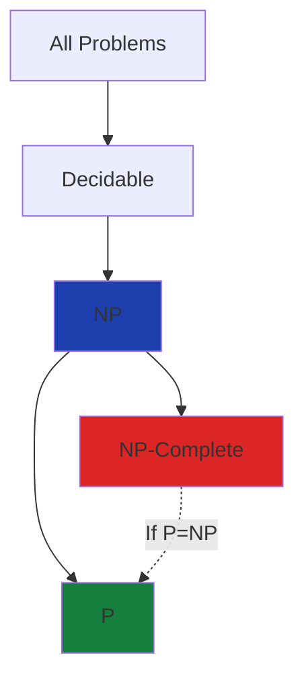

# Complexity Theory
## P, NP, and NP-Complete Problems

<div class="pt-12 text-gray-400">
Understanding computational complexity
</div>

---
layout: center
---

# What is P?

<v-clicks>

**P** = Polynomial Time

Problems that can be **solved** in polynomial time

Examples: O(n), O(n²), O(n³), O(n^k)

</v-clicks>

<v-click>

<div class="mt-12 p-6 bg-gray-800 rounded-lg">
<div class="text-sm text-gray-400 mb-2">Efficient and tractable</div>
<div class="text-2xl">If you can solve it quickly, it's in P</div>
</div>

</v-click>

---
layout: two-cols
---

# P Examples

<v-clicks>

**Sorting**
- Merge sort: O(n log n)
- Quick sort: O(n log n)

**Searching**
- Binary search: O(log n)
- Linear search: O(n)

**Graph Problems**
- Shortest path (Dijkstra)
- Minimum spanning tree

</v-clicks>

::right::

<v-click>

```python
# Simple P problem: Finding maximum
def find_max(arr):
    max_val = arr[0]
    for num in arr:
        if num > max_val:
            max_val = num
    return max_val

# Time: O(n) - Polynomial!
```

</v-click>

---
layout: center
---

# What is NP?

<v-clicks>

**NP** = Nondeterministic Polynomial Time

Problems where solutions can be **verified** in polynomial time

All P problems are in NP (P ⊆ NP)

But is P = NP? 🤔

</v-clicks>

<v-click>

<div class="mt-12 p-6 bg-blue-900/30 rounded-lg border border-blue-500">
<div class="text-xl">The Million Dollar Question</div>
<div class="text-sm text-gray-400 mt-2">One of the 7 Millennium Prize Problems</div>
</div>

</v-click>

---

# NP Example: Sudoku

<div class="grid grid-cols-2 gap-8">

<div>

### Solving (Hard)
- Try different combinations
- Backtracking required
- Exponential time in worst case

### Verifying (Easy)
- Check each row: O(n)
- Check each column: O(n)
- Check each box: O(n)
- **Total: O(n²) - Polynomial!**

</div>

<div>

```python
def verify_sudoku(board):
    n = len(board)
    
    # Check rows
    for row in board:
        if not is_valid_set(row):
            return False
    
    # Check columns
    for col in range(n):
        column = [board[row][col] 
                  for row in range(n)]
        if not is_valid_set(column):
            return False
    
    return True

# Verification: O(n²) ✓
```

</div>

</div>

---
layout: center
---

# NP-Complete

<v-clicks>

The **hardest problems** in NP

If you solve one NP-Complete problem in P time,
you solve **all** NP problems in P time

**P = NP** would be proven!

</v-clicks>

<v-click>

<div class="mt-8 text-center">
<div class="text-6xl mb-4">🔗</div>
<div class="text-xl">All NP-Complete problems are equally hard</div>
</div>

</v-click>

---

# Properties of NP-Complete

<v-clicks depth="2">

1. **In NP**
   - Solutions can be verified in polynomial time

2. **NP-Hard**
   - At least as hard as every problem in NP
   - Every NP problem can be reduced to it

3. **Interconnected**
   - One NP-Complete problem can be transformed to another
   - Solving one solves them all

</v-clicks>

---

# Famous NP-Complete Problems

<div class="grid grid-cols-2 gap-6 mt-8">

<v-clicks>

<div class="p-4 bg-gray-800 rounded">
<div class="text-xl mb-2">🎒 Knapsack</div>
<div class="text-sm text-gray-400">Maximize value with weight limit</div>
</div>

<div class="p-4 bg-gray-800 rounded">
<div class="text-xl mb-2">🚚 Traveling Salesman</div>
<div class="text-sm text-gray-400">Shortest route visiting all cities</div>
</div>

<div class="p-4 bg-gray-800 rounded">
<div class="text-xl mb-2">🎨 Graph Coloring</div>
<div class="text-sm text-gray-400">Color nodes with k colors</div>
</div>

<div class="p-4 bg-gray-800 rounded">
<div class="text-xl mb-2">✓ SAT Problem</div>
<div class="text-sm text-gray-400">Boolean satisfiability</div>
</div>

</v-clicks>

</div>

---
layout: two-cols
---

# Code Example
## Subset Sum Problem

<v-click>

**Problem**: Does a subset sum to target?

**NP-Complete** because:
- Easy to verify
- Hard to solve (exponential)

</v-click>

::right::

<v-click>

<div class="text-sm text-gray-400 mb-2">Input: [3, 1, 5, 9, 12], Target: 8</div>

</v-click>

````md magic-move
```python
# Input array and target
arr = [3, 1, 5, 9, 12]
target = 8
```

```python
# Brute force: Try all subsets
arr = [3, 1, 5, 9, 12]
target = 8

def subset_sum(arr, target):
    n = len(arr)
    # Try all 2^n subsets
    for i in range(2**n):
        subset = []
        for j in range(n):
            if i & (1 << j):
                subset.append(arr[j])
```

```python
# Brute force: Try all subsets
arr = [3, 1, 5, 9, 12]
target = 8

def subset_sum(arr, target):
    n = len(arr)
    # Try all 2^n subsets
    for i in range(2**n):
        subset = []
        for j in range(n):
            if i & (1 << j):
                subset.append(arr[j])
        
        if sum(subset) == target:
            return True, subset
    return False, []

# Output: True, [3, 5]
# Time: O(2^n) - Exponential!
```
````

---

# Verification is Easy

````md magic-move
```python
# Found solution: [3, 5]
solution = [3, 5]
target = 8
```

```python
# Found solution: [3, 5]
solution = [3, 5]
target = 8

def verify_subset_sum(subset, target):
    return sum(subset) == target
```

```python
# Found solution: [3, 5]
solution = [3, 5]
target = 8

def verify_subset_sum(subset, target):
    return sum(subset) == target

# Verify
result = verify_subset_sum(solution, target)
print(result)  # True

# Time: O(n) - Polynomial!
# This is why it's in NP
```
````

<v-click>

<div class="mt-8 p-4 bg-green-900/30 rounded border border-green-500">
Solving is hard (exponential), but verifying is easy (polynomial)
</div>

</v-click>

---
layout: center
---

# The Complexity Landscape

<div class="text-center">



</div>

<v-clicks>

<div class="mt-8 grid grid-cols-3 gap-4 text-center">
<div class="p-3 bg-green-900/30 rounded">P: Fast to solve</div>
<div class="p-3 bg-blue-900/30 rounded">NP: Fast to verify</div>
<div class="p-3 bg-red-900/30 rounded">NP-Complete: Hardest</div>
</div>

</v-clicks>

---
layout: center
---

# Why Does This Matter?

<v-clicks depth="2">

**Practical Implications**

- Know when a problem is inherently hard
- Don't waste time finding perfect solutions
- Use approximation algorithms instead
- Understand computational limits

**Real World**

- Cryptography relies on NP-hard problems
- Route optimization (logistics)
- Resource scheduling
- Network design

</v-clicks>

---
layout: center
class: text-center
---

# Key Takeaways

<v-clicks>

<div class="text-xl space-y-4 mt-8">

**P** = Can solve quickly

**NP** = Can verify quickly

**NP-Complete** = Hardest problems in NP

</div>

<div class="mt-12 p-6 bg-purple-900/30 rounded-lg border border-purple-500">
<div class="text-2xl">P = NP ?</div>
<div class="text-sm text-gray-400 mt-2">Still unsolved after 50+ years</div>
</div>

</v-clicks>

---
layout: end
class: text-center
---

# Thank You

<div class="text-gray-400 mt-4">
Questions?
</div>